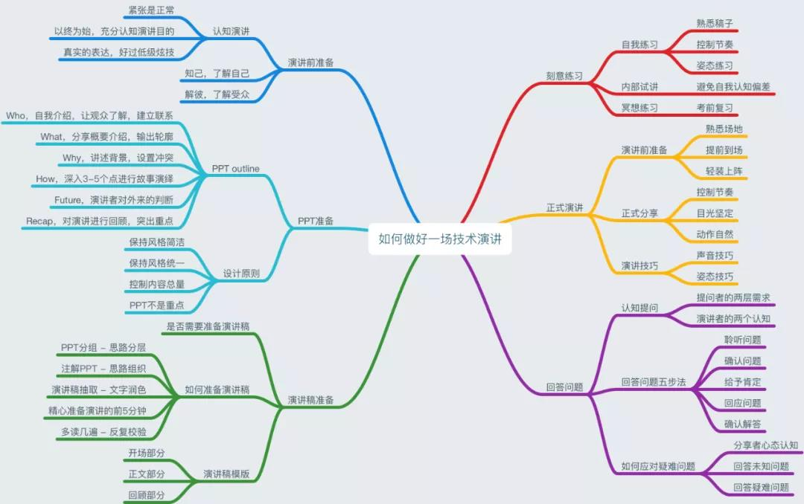
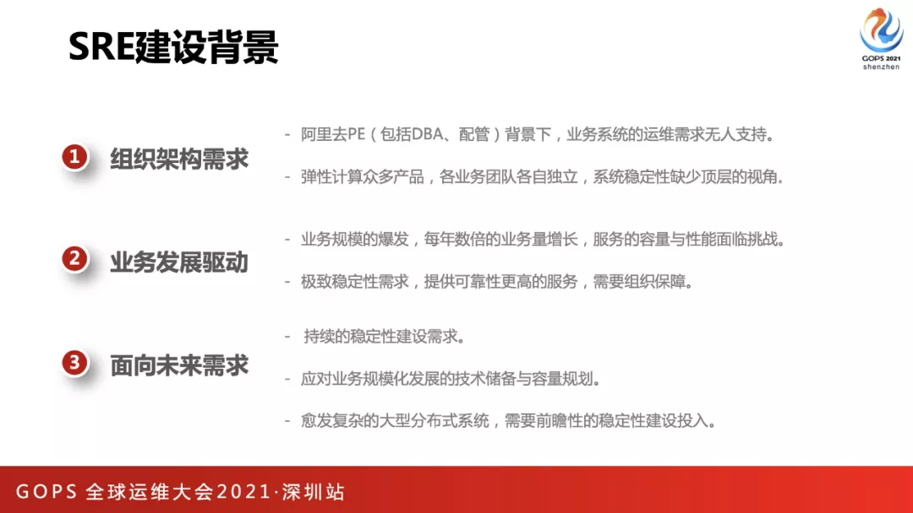
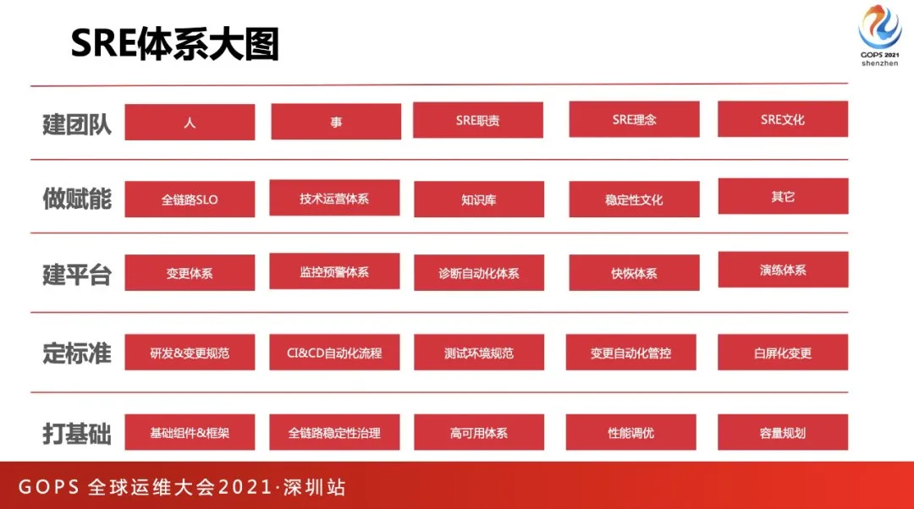
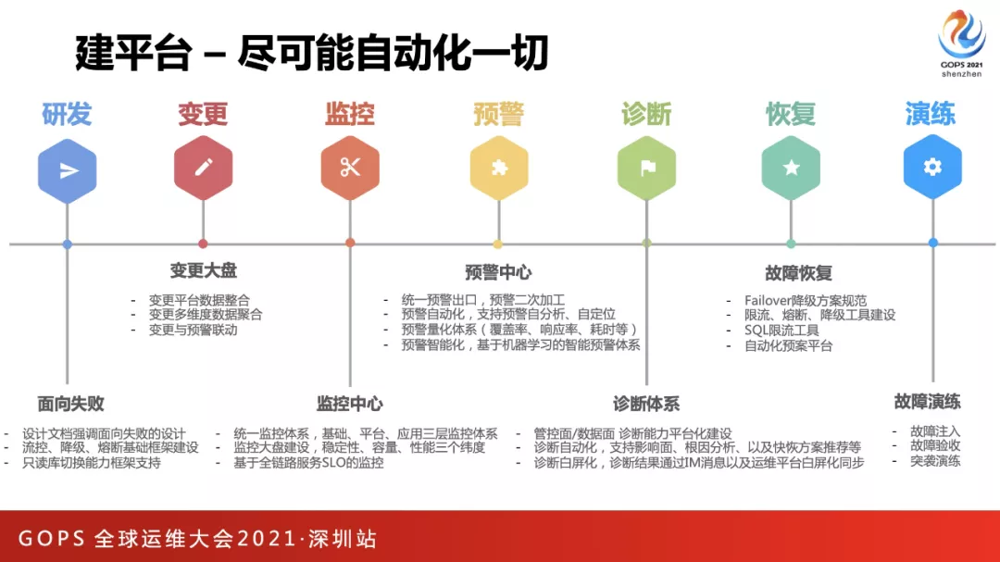
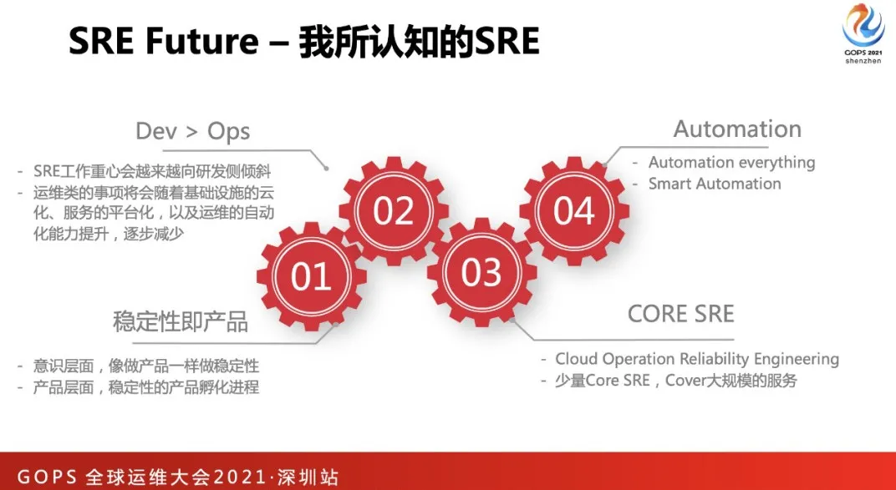
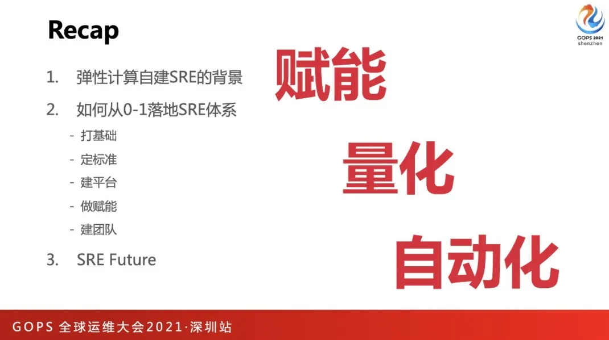

前言

本文将从新人首次演讲的准备全过程视角来分享一下，作为技术人，如何做好一场技术演讲。笔者通过这次演讲总结了一个“技术演讲准备六步法”，
即演讲前准备-> PPT准备-> 演讲稿准备->刻意练习->正式演讲->Q&A，期望可以通过分享帮助一些技术同学，尤其是像笔者一样的演讲新人，
从零开始准备并完成一场公众技术演讲。下文将会按照六步法顺序进行讲述，建议按顺序阅读，当然对部分内容感兴趣的也可以直接跳到对应章节。

一  演讲前准备

凡事预则立，不预则废。在正式演讲准备前，对演讲这件事以及演讲的主体，进行一定了解是不可或缺的。

1  认知演讲

紧张是正常的

首先要认识到紧张是正常的，紧张并不是演讲新人的特质。其实，大家熟知的一些演讲天才家像乔布斯，以及TED的非常多的知名演讲者都曾透露过他们面对演讲也会紧张。当然，我们面对的场景比如规模、受众人群与这些优秀的演讲者自不可相比，不过面对演讲时的紧张与恐惧情绪是大家共有的。

那么如何正确认识紧张的情绪？首先，我们要认识到，人人都会紧张，我并不是特例。其次，我们要做的是充分的准备与不断的刻意练习。当我们对自我以及受众可以做到知己解彼，对于演讲的内容可以做到庖丁解牛的程度，此刻紧张与否已经不重要了，因为它并不会对你的演讲产生本质上的影响。

充分认识演讲的目的

其次，我们要认识到演讲的目的是什么？是为了布道，推广技术还是“带货”？以及为啥要我来演讲，整个过程其实就是“知己”。因为后续无论是PPT制作，演讲稿准备以及刻意练习的前提都需要先充分认识演讲的目的，以终为始，才能事半功倍。

真实的表达好过低级炫技

最后，不是任何人都可以炫技，低级的炫技效果会恰得其反，这里的炫技包括但不限于：

精（花）美（里）绝（胡）伦（哨）的PPT

精心设计的装扮与动作

精心准备的梗

...

当然这里并不是说PPT要丑，着装要随意，讲述要平白，而是想要表达：如何把想要表达的目的思想，通过真实、自然、柔和（润物细无声）的方式传达给观众，并引发共鸣与思考（高阶需求），这个才是演讲的重点。

2  知己，了解自己

前面讲到了解演讲目的是一个知己的过程，其实我理解的知己包括“人”和“事”两部分，其中“事”就指演讲目的，就是我们演讲时为了完成一件怎样的事情；而关于“人”呢，我觉得是要充分认识自己，比如：

适合什么样的演讲风格？不用盲目学习别人，寻找自己感觉舒服的演讲风格，如果自己都觉得别扭，传达到观众效果自不必说。笔者在准备期间也看了大量的演讲视频，最后深深领悟到别人的闪亮之处是你学不来的。

在演讲方面的优势是什么？劣势又是什么？如何扬长避短？这里为什么不说补短而要避短呢，我觉得可以把优势发挥到最大程度，而又可以把劣势做到不那么致命，是一件性价比更高的事情。

3  解彼，了解受众

知己解彼，如果说认识演讲目的与自我是“知己”，那么，了解观众就是一个解彼的过程。道理其实很简单，观众才是演讲的主角，演讲者自身并不是！演讲的目的就是将主题传递给观众，演讲者只是一个载体，所以充分了解观众是演讲成功的前提，也是第一个核心步骤，通常我们了解观众如下几个方面：

观众群体分布，了解观众的群体分类，以及专业程度，比如这次参加GOPS大会分享SRE的主题确定后，我会先了解往年参加GOPS大会的都是哪些人员，是开发比例多还是运维比例多？是一二线公司比较多还是小公司比较多？诸如此类。

感兴趣的话题，在了解观众群体的基础下，可以接着深入分析了解一下不同分层的观众的关注点分别是什么？还是以笔者此次分享为例，在大概了解到参会者的公司分层以及角色占比后，我在演讲内容中会倾向性讲一些和观众息息相关的痛点，本质上还是为了和观众产生共情，同时可以以观众比较容易接受的方式传递主题相关信息。

观众受益点，说白了就是大家看完你的演讲，可以收获到什么，比如笔者期望通过分享可以让大家了解研发团队如何自建SRE体系，以及建设SRE体系通常需要做哪些层次的事情等，这些就是观众的受益点。

二  PPT准备

适用于Keynote或者其他类似工具，由于GOPS大会本次仅提供了PPT模版，笔者下文举例都会以PPT为例。通常技术演讲的模式是比较固定的，所以PPT内容的outline相对来说也有一定套路的，下文以我在GOPS大会分享的PPT为样例，做一个介绍。

1  PPT outline

Who

自我介绍部分，建议1页PPT，简单介绍我是谁，我做过什么，核心在于和观众建立联系，并传达为啥我有资格可以讲这个Topic。

What

建议一页PPT，通过最简单语言讲述今天要分享的主题，可以让观众通过一句话了解到你要讲的是什么（分享演讲主题的骨架也是一个不错的方式）。

Why

1-2页PPT，重点部分，需要在短篇幅内讲清楚演讲主题的背景，吸引观众的注意力以及引发共鸣。

How

核心演讲内容，通常控制在5-10页，建议展开3-5个点讲，每个点1-2页。每个点表达上要体现出逻辑性和层次性，通常每一个点要有故事可以讲出来，背景-案例-挑战-解法-成果。

Future

可选部分，建议1页PPT，核心表达的是演讲者对演讲涉及核心技术未来的看法。通常作为技术类演讲，受众通常为技术类人员，不止关心演讲者想表达的技术现状，对于演讲者对于目标内容的未来看法也通常比较关心。比如笔者这次分享的SRE部分，受众通常是运维人员，大家在了解弹性计算SRE做了些什么的时候，通常也会关心我们未来会做什么？我们对技术方向的判断是什么？

Recap

结尾总结，建议使用1页PPT汇总，同时突出重点（重点内容字体要足够大，大到醒目）。通常的技术演讲时间会在30分钟以上，当演讲进行到尾声的时候，观众可以记住的内容已经非常少了。而结尾时刻的内容也是受众者比较关注的，这个时候演讲者来一段提纲挈领的总结，可以有效帮助大家形成对演讲Topic的整体脉络记忆，同时这个时候一定要把会议想要表达的核心思想表达出来，再次强化。

2  设计原则

PPT设计是一个技术活儿，从内容设计到软件使用，每一个部分都有大量的知识值得学习。在这里我想和大家分享的并不是如何设计PPT（如果大家感兴趣，再抽时间把我有限的PPT技能做个总结），而是PPT设计的一些基本原则。只要遵循这些基本原则，不需要懂任何PPT软件（PowerPoint、Keynote等）的高级技巧，也不需要懂内容编排就可以做出来一个简约的PPT来满足绝大部分日常场景。大家可能注意到TED演讲以及一些知名的演讲者所呈现给观众的PPT，鲜有精美绝伦，更多的是简约而不简单，内容（PPT内容以及演讲者讲述的）才是重点！

保持风格简洁

字号一定不要超过5种，通常情况不要超过3种：

颜色不超过3种

不用刻意选择动画

保持风格统一

选择一种字体

相同作用的文字或者图片，使用相同的格式

图片风格统一

控制内容总量

PPT页数通常不超过30页，核心内容页不超过20页

每页文字内容少于篇幅1/2

PPT不是重点

PPT永远不是重点，内容才是！

不要过度雕饰PPT

三  演讲稿准备

当PPT准备好了之后，大部分同学可能觉得，演讲的素材已经有了，是不是可以直接“躺平”了。显然不是，那些大家所知的非常职业的演讲比如乔布斯在苹果发布会以及在斯坦福上的演讲，我们能看到的Keynote只是老爷子演讲准备中，最简单的一环，此外专业的演讲稿准备以及大量的刻意练习缺一不可，下文将逐一进行讲述，首先介绍一下演讲稿准备。

1  是否需要准备演讲稿

首先，大家可能会纠结于要不要写正式的演讲稿？笔者曾经也纠结过这个问题，之前的内部分享都习惯了临场发挥，所以在内部第一次试讲的时候，发现自己讲出来的内容的逻辑性以及连贯性都不太好，甚至还不如观众直接看PPT来的痛快。简单复盘下来，最根本的原因之一是因为临场的语言组织能力会强依赖不可控的因素比如环境（受众变化，地点变化等），自我情绪状态（紧张），而有效的解决方法就是备稿并持续刻意练习。

所以，我觉得通常情况，尤其是作为演讲新人来讲，演讲稿准备是非常必要且重要的一个环节，那么如何准备演讲稿呢，下面系统性的介绍一下我的思路。

2  如何准备演讲稿

演讲稿一定是源于PPT的，PPT是观众最直观可以触达的，演讲也是围绕PPT来进行的，所以演讲稿首先一定是源PPT的，但是如果演讲稿一味和PPT一致，那么演讲也就失去了意义，直接看PPT不是来的更直接，高效吗？

所以，我理解理想的演讲稿应该是源于PPT，但超脱于PPT。简单解释一下，PPT是演讲的骨骼，而演讲稿应该是血肉，演讲稿存在的价值是让演讲变成“血肉之躯”，而演讲者本身依托于此，并赋予其灵魂。下面，分享一下我的演讲稿准备过程。

PPT分组 - 思路分层

首先可以将PPT进行分组，前文讲到了PPT的一个outline，who-what-why-how-future-recap，而在演讲过程中我们可以根据演讲内容将PPT进行一个分组（括号内为每个部分大概需要演讲的时间）。

开场部分（5分钟），通常介绍who-what-why，介绍我是谁，我要讲什么，以及承上启下讲述正文背景。

正文部分（20-25分钟），正文干货部分，介绍演讲主题核心内容。

回顾部分（2分钟），演讲内容回顾，划重点。

注解PPT - 思路组织

分组做完之后，接下来需要做的一件事就是需要完成源于PPT的演讲稿，我自己采用的一种方式是直接在每页PPT下写下演讲者注释，好处有两个：

演讲本身是基于PPT的，针对每页PPT写下针对当前页的演讲内容，是一种自然的组织方式。

演讲者注释可以反过来帮你review PPT的组织思路，提前发现设计不好地方。

演讲稿抽取 - 文字润色

所有的PPT完成注释后，将每页PPT的注释按照第一步的分组组织成一份文稿，演讲稿的初稿就完成了。不过这只是一个没有经过语言润色的初稿，只是思路上帮你串起来了，接下来需要按照演讲的场合来进行润色，那是不是通篇都需要润色？看起来是一个大工程，其实一般演讲场合，我们只需要重点关注前几分钟。

精心准备演讲的前5分钟

为什么要精心准备前5分钟？理由有两个：

好的开场非常重要，有利于缓解甚至消除演讲者的紧张情绪。笔者演讲的前五分钟是脱稿背下来的，事实证明，前五分钟不出问题，上台后紧张情绪是会瞬间消除的。

前五分钟通常是自我介绍以及演讲主题的的整体介绍，观众的关注度是相对比较高的。

所以，前五分钟的演讲内容建议一定要精心准备，并反复刻意练习，可以做到即使紧张情况也可以脱稿的方式完整表述出来。至于后面的文稿是不是需要背下来，就看自己的需求了，个人不建议通篇脱稿。通常情况无论你怎么准备，现场演绎内容永远和文稿内容是两个版本，我们不是机器人，不是吗？

多读几遍 - 反复校验

演讲稿完成后，需要反复多读几遍，反复校验文稿通篇的连贯性以及逻辑的清晰度。另外一个角度，通常演讲后都会有对应的文章发布，而好的演讲稿只要稍微整合一下就可以完整输出，一举多得，助人助己。

3  演讲稿模版

下面以笔者此次GOPS大会分享准备为例，和大家分享一个相对通用的模版。

开场部分

通常开场部分由三部分组成：个人介绍，演讲主题介绍，以及观众收益点介绍。

个人介绍，介绍自己的个人阅历，主要讲清楚为什么你有资格讲这个topic，另外也可以拉近和观众的距离。

演讲主题介绍，介绍一下演讲的outline，让观众从整体上对演讲内容有一个轮廓，这个非常有必要。

观众受益点介绍，直接告诉观众，这次演讲可以帮助他收获什么？这个通常是观众最关注的，不然干嘛要花钱、花时间听你吹牛？

举个例子：

大家下午好，我是来自阿里云弹性计算的研发，很高兴可以在这里和大家分享交流过去弹性计算建设SRE体系的一些经验。（寒暄一下）

在开始正式分享之前，先做一个简单的自我介绍，我在阿里大概七年的时间，一直从事DevOps平台以及云计算相关的研发工作，负责过集团的变更管控、StarAgent等基础运维自动化平台，同时也主导了弹性计算SRE体系的落地。（自我介绍）

今天我分享的Topic是《大型研发团队SRE探索与实践》，主要介绍的是弹性计算团队在SRE体系建设上的一些思考和落地实践（讲什么）。

期望通过这次分享交流，可以帮助大家可以了解到如何在一个研发团队内从0-1落地SRE体系来解决稳定性问题，以及建设SRE体系，通常需要关注哪些层面事情。（观众受益点）

正文部分

这部分会是演讲的核心部分，对于技术类演讲，单纯的干货分享，想要吸引观众的长期注意力会非常困难，这里我想和大家分享几个组织正文的要点。

内容要起承转合，通常都可以按照 背景介绍（埋伏笔） -> 问题与挑战（冲突设置）-> 解决方案（权衡与取舍） -> 效果（点燃一下激情） -> 总结（听众受益点）这样的逻辑顺序进行演绎。

要学会讲好故事，好的故事不仅能更好的呈现演讲内容，也是观众最容易产生共情的依托点。

要有突出的金句，金句是内容部分的MVP，也是演讲者最核心的观点，往往可以在观众脑中产生爆点。

举个例子（限于篇幅，此处做了大量删减，只介绍思路）：

ECS使用了非常多的预警平台，从基础监控、业务监控、到中间件监控，xxx。（背景介绍）同时由于历史原因，我们每天预警数量在4w+，由于体量大，跨团队，平台多，预警难以收敛。（讲冲突）

举个例子，RDS down没有预警，导致故障定位以及回复时间长。（讲故事）

我们针对这种情况，设计两种方案：A：xxxxB：xxxx最终基于xxx的考虑，选择了方案A。（讲trade-off）通过xxx的持续治理，我们的预警量从每天4.5w+降到每天2k左右，收敛95%。（讲效果）

通过这个例子，我推荐的预警体系是什么样的？xxxx（总结）

预警的建设是一个长期工作，核心打法是“预警四化建设”。标准化->持续收敛，数据化->持续赋能，自动化->解放人力，智能化->应对大规模服务预警。(勉强算金句)

回顾部分

一般的演讲通常都会有25分钟以上，通常观众的注意力很难维持在15分钟以上，尤其演讲到后期，观众可以记住的东西非常有限。而在心理学领域有一个“近因效应”，结尾处的内容观众是记忆最深刻的，所以，演讲者在结尾的时候做一个整体回顾就非常有价值了，一般回顾通常需要做以下两点：

整体内容回顾，从what->why->how->future 通过概述的方式花一分钟时间将演讲主线串联一下。

突出主题重点，此处一定要Highlight出来重点，一定是你最希望观众记住的点。

PPT Highlight，用PPT使用的字号集里面最大的字体通过对比色差来突出重点。
演讲 Highlight，演讲者通过较高的语调着重强调一下本次的演讲的核心之处。

以笔者此次参会为例，PPT部分大家可以看一下上文PPT outline Recap部分的示例，文稿示例如下：

今天主要分享的是弹性计算在业务研发团队SRE落地的一些实践，首先我向大家介绍了弹性计算的产品和业务背景，从组织视角，业务规模以及业务发展三个视角向大家解释了我们建设SRE的背景。然后，我向大家介绍了我们在业务团队从0开始落地SRE的一些打法，包括打基础，建立标准，建设自动化平台，做运营和赋能等，最后我向大家从ECS SRE的发展视角，粗浅的介绍了我对SRE发展以及未来的一些展望，希望可以对大家有所帮助，也欢迎感兴趣的同学可以做更多的沟通，最后再次谢谢大家的聆听。（演讲回顾）

最后我想特别和大家分享的是SRE精髓：赋能和自动化。（强调核心思想）

四  刻意练习

演讲稿准备完成后，在正式演讲前一定要有一个练习过程，千万不要让正式演讲成为你的第一次。通常练习次数不少于五次，这里有几种笔者尝试过的练习方式，介绍给大家，供参考。

1  自我练习

熟悉稿子，通过反复的模拟持续强化对演讲稿的熟悉程度，尤其是前五分钟，要做到倒背如流。

控制节奏，通过PPT自带的计时功能，与前文演讲稿准备环节每个部分规划的时间做对比，不断打磨，锻炼自己的节奏控制能力。（因为技术演讲通常没有人会中途打断，整体节奏都是由演讲者自己控制的。以笔者自己本次演讲为例，自我练习阶段平均演讲时间在35分钟，实际现场演讲时间也基本是一致的）

练习姿态，主要是找到适合自己的轻松的姿势，针对普通演讲，通常现场会手持话筒和遥控器，自己简单练习一下站姿和手势即可。

2  内部试讲

避免陷入自我认知偏差（自恋或者自卑），当自己准备差不多的情况，可以在内部试讲一下，让其它同学给予一些反馈。

3  冥想练习

比较适合于正式演讲前，可以通过冥想的方式，在脑海中录制一下整个过程，每页PPT是什么样的，我应该怎么讲，顺便看一下整体的节奏是否符合预期。

五  正式演讲

经过一段时间的精心准备以及大量的刻意练习，即使我们对自己排练的效果已经非常满意，但是在进入正式演讲前还是要做一些额外的准备，善始善终。

1  演讲前准备

前熟悉会场，陌生的事物容易引起人的恐惧情绪，提前熟悉演讲环境有助于减轻紧张情绪。

提前到达会场，一定要早于自己的演讲时间一个小时，用于近距离熟悉环境。

轻装无压上阵，我只带了一只手机，身轻即神清。

不要喝太多水，不要问我为什么，不想说话。

2  正式分享

语速不要太快，正常语速完成开场五分钟。

动作不要夸张，仪态要自然。

目光要坚定，目光的坚定源于内心的坚定（认可自己分享内容的价值），所谓心中有爱，眼里才有光。

控制节奏，不要超时（通常现场会有工作人员提醒，也可以通过手表、手环等做自我提醒）。

不要害怕失误，要意识到通常90%的失误只有演讲者自己能感知到，观众是无感的。

3  一些技巧

声音技巧

合理的使用声音技巧（抑扬顿挫）会使演讲表现的更饱满，好比长得好看也要适度装扮一下。

语速快&语调高表示激动、愤怒。

语速慢&语调低代表悲伤、真诚。

语速慢&语调高代表强调、权威。

语速快&语调低表示内容的过渡。

停顿，此时无声胜有声。

姿态技巧

用最自然的姿态，不要做作。

目光要坚定，勇敢的面对台下观众眼神（和满屋子“大白菜”对视有啥紧张的？）。

想象自己是一个灯塔，缓慢扫视全场，可以和局部有眼神交流。

“切西瓜”的手势，这个是看文章推荐的，拿话筒的场景就不适用了。

六  回答提问

演讲完成并不代表谢幕，问答环节同样重要，一定程度更能反应演讲者的综合素质。那么如何做好Q&A环节呢，下面展开讲述。

1  认知提问

提问者的两层需求

通常每一个问题提问者都会有两层需求，一层是显性“物质”的，一层是隐形“精神”的。首先，提问者的最根本的显性需求是问题本身，这个需要演讲者给出实质的逻辑答案。其次，提问者希望自己提出来的是一个高质量的问题，所以潜在的精神需求是希望问题本身得到认可。概括来说，提问者希望得到问题答案的同时，得到演讲者针对问题本身的认可。

演讲者的两个认知

首先，演讲者要有谦卑的姿态，要认识到自己并不是真的来讲课或者炫技的，而是来分享交流的。演讲者从内心真正有分享者而非授业者的认知，不仅对于观众的提问可以从容应对，对于演讲本身也会减轻心理负担。打破演讲者自我的权威意识，会使演讲者自身更加自然，观众对演讲者的直观感受也会更真实。

其次，演讲者要认识到提问本身是对事不对人的。尤其当观众当场提出质疑、挑战甚至是挑衅的问题时，作为演讲者要意识到观众质疑或者挑战的并不是你个人，而是你传达出来的内容本身。此时演讲者可以做一个简单的自我提醒，如果换一个人来讲也并不会改变观众的提问本身，此刻，演讲者的坏情绪大半已经消散了。

2  回答提问五步法

回答问题，切忌嘴比脑快，谨言慎行，不足为过。

聆听问题

首先，要学会移情聆听，移情聆听的几个要点：

站在对方角度思考，先理解别人，而不是急于应答。我们通常习惯于将重心落在思考如何应答上，也就是站在自我角度来考虑问题，如果转向先理解别人（也就是读懂需求啊），效果会更好。

关注对方情绪变化，适当给予反馈，让对方感到重视。比如当观众提问的时候，演讲者应该尽可能的给予眼神或者手势等反馈，让观众感受到，你确实是在认真听我说。

尽量不要打断别人，等对方话落后，确认是否陈述完成。通常来说，如果不是提问者在宣扬反动主义，我们有什么理由，要在别人提问的时候插嘴呢？

确认问题

每个人的“阅历”和“素质”都不同，我们很难做到每次都能真正理解对方的问题，而在回答之前，演讲者的首要目标就是先确认自己真正的理解问题。所以，推荐的做法是二次确认，也就是演讲者通过复述的方式，再次将自己的理解，通过一句概要的总结陈述出来，并转达给提问者，进而得到提问者的反馈，最终目标是双方就问题本身达成共识。

给予肯定

前面提到了提问者的两层需求，其中一层是隐形的精神需求，一个完整的答案，不止于解答问题本身，同时我们应该先满足提问者的精神需求，这层是非常容易做到，也是最容易被疏忽的。如何满足提问者的精神需求，也就是演讲者如何给予提问者正向反馈，这里推荐几个方式：

语言给予肯定，最直接有效的方式。演讲者可以在问题达成共识后，接着肯定这是一个非常好的问题。

肢体语言反馈，通过眼神或者手势。这个可能在双方近距离情况下效果比较好，比如眼神赞同和近距离轻拍对方肩膀等，远距离情况，提问者也许很难看穿你小眼睛里的蕴含的眼神。

回应问题

给予肯定，满足了提问者隐形的“精神需求”，这个是锦上添花的事情，最终我们还是要回归到问题本身，满足提问者的“物质需求”，即尽量通过简短的语言给出有逻辑性的实质答案，这里有几个要点分享一下：

回答问题要简洁，直击要点，避免长篇大论。抓重点，直接回答问题，不要绕弯子。（个人觉得有话直说是最简单高效的沟通方式）

注意措辞的逻辑性，避免“语无伦次”的回答。回答问题可以慢，给自己留出思考以及语言组织的时间，表达上要能体现基本的逻辑关系，比如第一点，第二点 ...，或者 首先，其次，然后，最后等。

接受不同的声音，尊重每一个提问者。还是回到演讲者的自我认知，认识到自己是来分享的，而不是来建立权威的，那么面对提问者对演讲内容的质疑，甚至反对，你依然会淡然处之。

如果遇到疑难问题，不知道怎么回答该怎么办？往下看。

确认解答

有始有终，确认问题->回答问题->确认解答，这是一个完整的故事。所以非常推荐演讲者在问题回答完成后，再次和提问者确认一下问题有没有解答，一方面能表现出演讲者对提问者的尊重，另一方面也能体现出演讲者的素质。通常，我们可以通过柔和的语调来确认：“不知道我的回答有没有解答您的问题，有问题我们可以再补充或者线下再沟通”。

3  如何应对疑难问题

分享者心态认知

演讲者如果是分享者心态，去掉心理上的权威包袱，当面未知的问题，疑难的问题甚至是敏感的问题，心态上可以做到波澜不惊，此时关于如何回应问题其实只是一个“技术”问题了，至于这个问题回答的效果如何，已经没有那么重要了。分享者心态的几个要点：

尊重平等，认识到演讲者和观众地位是平等的，大家其实是“同学”关系。

开放谦虚，求同存异的态度，欣赏和学习的心态来面对差异文化。

宠辱不惊，中和是最好的状态，明白自己的目标，不因外物而动摇。

坦诚真实，知之为知之，不知为不知，不可佯装。

如何回答未知问题

前面提到的了演讲者要坦诚真实，面对未知的问题，作为一个普通的演讲者，首先我们要做到 “不知为不知”，其次我们尽可能在在真诚表达的同时，给予提问者一定的正向反馈，起码是精神层面的，要求演讲者做到两层：

首先，坦诚的表达自己对问题涉及的领域是认知不够的，并表示歉意（相信观众不会欺负“弱者”吧）。

然后，简短的根据自己的经历和理解给出一个你认为合理的方向或者建议，给到提问者供其参考。

如何回答疑难问题

这里简单总结了几个方法，供大家参考：

以点破面，当对方提出问题scope很大导致你无法回答的场景，可以尝试选取一个切入点来回答。

转移问题，可以根据问题相关性，尝试转移到自己熟悉的相关问题，当然这个尺度不好把握。

引导沟通，引导提问者这线下沟通，可以尝试和提问者沟通说明问题的复杂性，并引导线下沟通。

寻求帮助，如果在场的有你认识或者了解的领域专家比你在该问题上更有发言权，可以寻求帮助。

写在最后

以上仅仅是一个演讲新人视角的分享，供大家参考，也期待大家的经验分享，共同进步。
最后，推荐两本书《ppt要你好看》、《演说之禅》。

